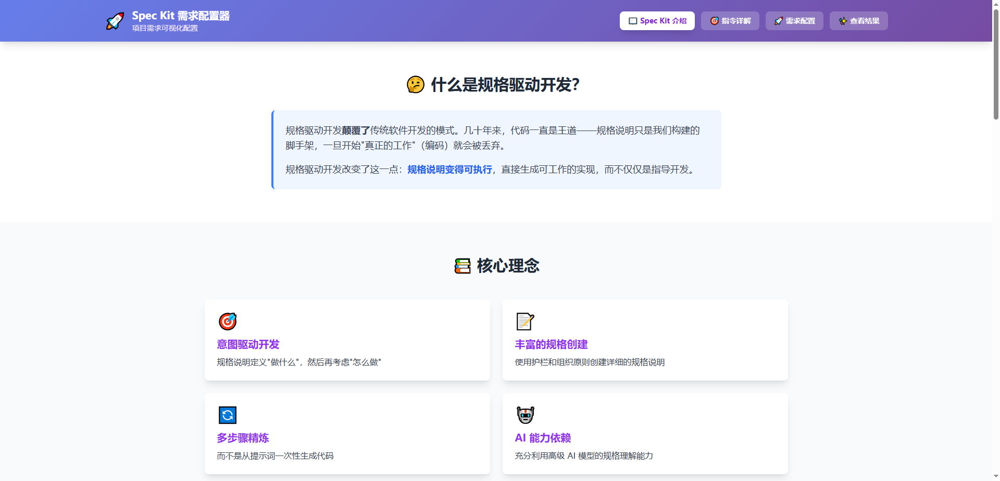
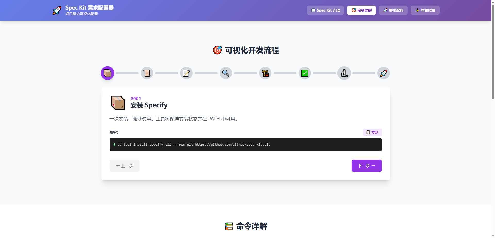
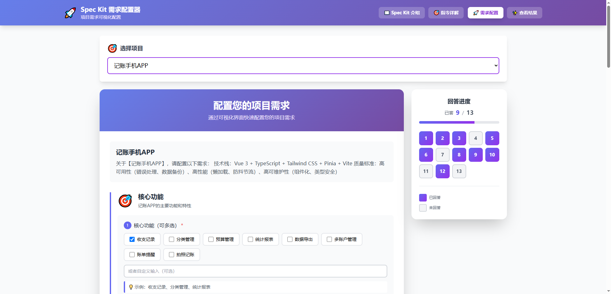
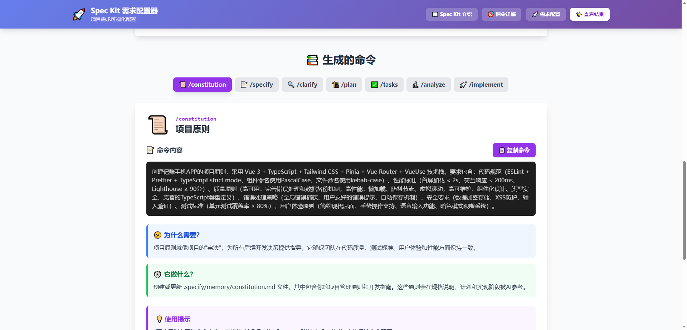

# Spec Kit UI MCP

> 交互式 MCP 服务器，通过可视化界面收集项目需求，自动生成 Spec Kit 7 条命令。专为 Cursor 编辑器优化。

[](https://www.npmjs.com/package/spec-kit-ui-mcp)
[](https://opensource.org/licenses/MIT)

## ✨ 特性

- 🎯 智能需求收集 - 通过交互式网页表单收集项目需求
- 🤖 AI 驱动 - AI 根据描述自动生成针对性问题
- 📊 多回合对话 - 支持多轮问答，逐步完善需求
- 🎨 美观界面 - 现代化 UI 设计
- 📝 自动生成命令 - 基于需求自动生成 7 条 Spec Kit 命令
- 💾 会话管理 - 自动保存会话历史

## 📦 在 Cursor 中使用

### 1. 配置 MCP 服务器

在 Cursor 的设置中配置 MCP 服务器：

打开 Cursor 设置 → MCP → 添加服务器配置：

```json
{
  "mcpServers": {
    "spec-kit-ui-mcp": {
      "command": "npx",
      "args": ["-y", "spec-kit-ui-mcp", "--work-dir", "工作目录地址"]
    }
  }
}
```

### 2. 重启 Cursor

配置完成后，重启 Cursor 使 MCP 服务器生效。

### 3. 开始使用

在 Cursor 的 AI 对话框中，直接描述你的项目需求：

```
我想做一个电商网站，包含商品列表、购物车、订单管理功能
```

AI 会自动调用 MCP 工具，引导你完成需求收集并生成 Spec Kit 命令。

## 📸 界面预览

### 需求收集界面



### 问题配置界面



### 需求分析界面



### 命令预览界面



## 🎯 完整使用案例

### 案例 1：快速创建待办事项应用

**第一步：描述项目需求**

```
我想做一个待办事项应用
```

**AI 自动执行：**

1. 调用 `gather` 工具收集需求
2. 打开浏览器展示问题配置表单
3. 你填写完成后提交

**第二步：AI 分析需求**

AI 调用 `analyze` 工具分析需求是否完整。

- 如果需求不够明确，AI 会继续问问题（多轮对话）
- 如果需求明确，AI 继续下一步

**第三步：生成 Spec Kit 命令**

AI 调用 `build` 工具生成 7 条命令：

- `/constitution` - 项目原则和开发规范
- `/specify` - 功能规格和用户故事
- `/clarify` - 技术细节澄清
- `/plan` - 技术实现方案
- `/tasks` - 任务分解和评估
- `/analyze` - 风险分析和缓解
- `/implement` - 具体实现指导

**第四步：预览命令**

AI 调用 `preview` 工具在浏览器中展示生成的命令，你可以复制使用。

### 案例 2：创建复杂项目

```
我想做一个在线教育平台，包含：
- 课程管理：老师可以创建、编辑课程
- 视频播放：支持视频进度记录
- 作业系统：学生提交作业，老师批改
- 讨论区：师生互动交流
- 数据分析：学习行为分析
```

AI 会引导你逐步完善：

- 用户角色和权限
- 技术栈选择
- 部署方式
- 性能要求
- 安全考虑

最终生成完整的 Spec Kit 7 条命令。

### 案例 3：学习 Spec Kit 命令

如果你不熟悉 Spec Kit，可以在 Cursor 中说：

```
我想学习 Spec Kit 的命令
```

AI 会调用 `learn_speckit` 工具，打开交互式学习页面，详细介绍每个命令的用途和使用方法。

## 🛠️ MCP 工具详解

### 1. `gather` - 收集需求信息

**作用：**
收集用户的项目需求信息，AI 根据项目描述自动生成针对性问题配置。

**参数：**

- `projectIdea` (必填): 项目想法描述，例如 "我想做一个待办事项应用"
- `userResponse` (可选): 用户之前填写的回答文本（用于多轮对话）
- `previousFeedback` (可选): 用户的修改意见（用于多轮对话）
- `sessionId` (可选): 会话 ID，提供则继续现有会话，否则创建新会话

**使用场景：**

- 第一次描述项目需求
- 需要补充更多需求信息
- 修改之前的需求回答

**工作流程：**

1. 检查 SpecKit 是否已初始化
2. 创建或继续会话
3. AI 生成问题配置 JSON
4. 自动调用 `configure` 工具打开可视化界面

**输出：**
返回 AI 提示词，指导 AI 生成需求配置 JSON 文件。

---

### 2. `configure` - 打开可视化配置界面

**作用：**
接收需求配置文件路径，启动本地 Web 服务器，在浏览器中展示配置表单，等待用户填写并提交。

**参数：**

- `configFilePath` (必填): 需求配置 JSON 文件的路径

**使用场景：**

- `gather` 工具生成配置文件后自动调用
- 需要用户填写具体需求信息

**工作流程：**

1. 读取配置文件验证有效性
2. 启动 Web 服务器（端口 3456）
3. 打开浏览器展示表单
4. 等待用户填写并提交
5. 保存用户回答到文件

**输出：**
返回格式化的用户回答文本和响应文件路径。

---

### 3. `analyze` - 分析需求完整性

**作用：**
分析收集到的需求信息，判断是否足够完整和明确。如果需求明确，生成需求总结并指示构建命令；如果不明确，指示继续收集更多信息。

**参数：**

- `projectIdea` (必填): 项目想法描述
- `userAnswers` (必填): 用户当前回答的文本
- `userResponseFilePath` (必填): 用户回答的响应文件路径（用于提取 sessionId）

**使用场景：**

- `configure` 工具获取用户回答后自动调用
- 判断是否需要继续收集需求

**工作流程：**

1. 从文件路径提取 sessionId
2. 保存输入参数到文件
3. AI 分析需求完整性
4. 如果需求明确，AI 生成需求总结 JSON
5. 如果需求不明确，AI 指示继续 `gather`

**输出：**
返回 AI 提示词，指导 AI 分析需求并决定下一步操作。

---

### 4. `build` - 构建 Spec Kit 7 条命令

**作用：**
基于完整的需求总结，生成 Spec Kit 7 条命令：`/constitution`、`/specify`、`/clarify`、`/plan`、`/tasks`、`/analyze`、`/implement`。使用 Vue 3 + TypeScript 技术栈，强调高可用、高性能、高可维护性。

**参数：**

- `requirementsSummaryFilePath` (必填): 需求总结 JSON 文件路径

**使用场景：**

- `analyze` 工具确认需求完整后自动调用
- 生成最终的 Spec Kit 命令

**工作流程：**

1. 读取需求总结文件
2. 提取项目想法和需求总结
3. AI 根据模板生成 7 条命令
4. 保存命令到 JSON 文件
5. 自动调用 `preview` 工具展示结果

**输出：**
返回 AI 提示词，指导 AI 生成 7 条 Spec Kit 命令的 JSON 文件。

**生成的命令包括：**

1. `/constitution` - 项目原则和开发规范
2. `/specify` - 功能规格和用户故事
3. `/clarify` - 技术细节澄清
4. `/plan` - 技术实现方案
5. `/tasks` - 任务分解和评估
6. `/analyze` - 风险分析和缓解
7. `/implement` - 具体实现指导

---

### 5. `preview` - 预览命令结果

**作用：**
接收命令结果文件路径，在浏览器中以美观的方式展示生成的 7 条 Spec Kit 命令，方便用户查看和复制。

**参数：**

- `commandsFilePath` (必填): 命令结果 JSON 文件路径

**使用场景：**

- `build` 工具生成命令后自动调用
- 查看已生成的命令结果

**工作流程：**

1. 读取命令结果文件
2. 验证文件格式有效性
3. 启动 Web 服务器（如果未启动）
4. 打开浏览器展示命令
5. 用户可以复制各个命令

**输出：**
返回命令列表摘要和浏览器展示页面。

---

### 6. `learn_speckit` - 学习 Spec Kit 命令

**作用：**
打开一个交互式网页，详细介绍 Spec Kit 的所有命令、用途、使用方法和最佳实践。

**参数：**
无需参数（或 `_` 占位参数）

**使用场景：**

- 不熟悉 Spec Kit 命令
- 想了解各个命令的详细用法
- 查看命令使用示例

**工作流程：**

1. 启动 Web 服务器（如果未启动）
2. 打开学习指南页面
3. 展示所有命令的详细说明和示例

**输出：**
返回提示信息，告知已打开学习页面。

**学习内容包括：**

- 📚 所有 Spec Kit 命令的详细说明
- 💡 每个命令的中文示例
- 🎯 可视化的开发流程
- 💭 实用的使用技巧

## 🔧 高级配置

### 为什么需要指定工作目录？

这个 MCP 需要在你的项目目录中创建和管理文件：

- 检查 `.specify/` 目录是否存在（SpecKit 初始化标志）
- 在 `.specify/ui-cache/` 目录下保存会话数据
- 存储生成的配置文件和命令结果

因此，**必须**在配置中指定 `--work-dir` 参数，指向你要开发的项目目录。

### 多项目配置

如果你有多个项目需要使用 Spec Kit UI MCP，可以为每个项目配置不同的服务器：

```json
{
  "mcpServers": {
    "spec-kit-project-a": {
      "command": "npx",
      "args": ["-y", "spec-kit-ui-mcp", "--work-dir", "E:/Projects/ProjectA"]
    },
    "spec-kit-project-b": {
      "command": "npx",
      "args": ["-y", "spec-kit-ui-mcp", "--work-dir", "E:/Projects/ProjectB"]
    }
  }
}
```

这样你可以在不同的项目间切换使用。

### 会话数据存储

所有会话数据自动保存在项目的 `.specify/ui-cache/` 目录下：

```
.specify/
  └── ui-cache/
      └── session-20231204-123456/
          ├── 1-gather-request.json      # gather 工具的输入参数
          ├── 1-gather-response.json     # AI 生成的问题配置
          ├── 1-gather-prompt.md         # gather 工具的提示词
          ├── 2-configure-response.json  # 用户填写的回答
          ├── 2-configure-prompt.md      # configure 工具的提示词
          ├── 3-analyze-request.json     # analyze 工具的输入
          ├── 3-analyze-response.json    # 需求总结
          ├── 3-analyze-prompt.md        # analyze 工具的提示词
          ├── 4-build-request.json       # build 工具的输入
          ├── 4-build-response.json      # 生成的 7 条命令
          └── 4-build-prompt.md          # build 工具的提示词
```

每个步骤都有完整的记录，方便追溯和调试。

## 💡 使用技巧

### 1. 提供详细的项目描述

```
✅ 好的描述：
我想做一个任务管理网站，包含看板视图、列表视图、
团队协作功能，界面简约现代，支持暗色模式，
使用 Vue 3 + TypeScript，部署到云服务器

❌ 不好的描述：
我想做一个网站
```

详细的描述能让 AI 生成更准确的问题配置。

### 2. 利用多轮对话完善需求

不用担心第一次说不清楚，AI 会通过多轮对话帮你完善需求：

- 第一轮：收集基本功能需求
- 第二轮：收集技术栈和部署方式
- 第三轮：收集性能和安全要求

### 3. 查看会话历史

所有会话数据都保存在 `.specify/ui-cache/` 目录，你可以：

- 查看之前的需求配置
- 修改用户回答并重新生成
- 对比不同版本的命令

### 4. 先学习再使用

如果你是第一次使用，建议先调用 `learn_speckit` 工具学习各个命令的用途，这样能更好地理解生成的结果。

## 🚀 开发

```bash
# 克隆仓库
git clone https://github.com/yourusername/spec-kit-ui-mcp.git
cd spec-kit-ui-mcp

# 安装依赖
npm install

# 构建
npm run build

# 开发模式
npm run dev
```

## 📄 许可证

[MIT](./LICENSE) © spec-kit-ui-mcp contributors

## 🙏 致谢

- [Model Context Protocol](https://github.com/modelcontextprotocol) - MCP SDK
- [Spec Kit](https://speckit.ai) - 开发方法论
- [Vue.js](https://vuejs.org) - 前端框架
- [Tailwind CSS](https://tailwindcss.com) - 样式框架

---

**如果有帮助，请给个 ⭐️ Star！**
